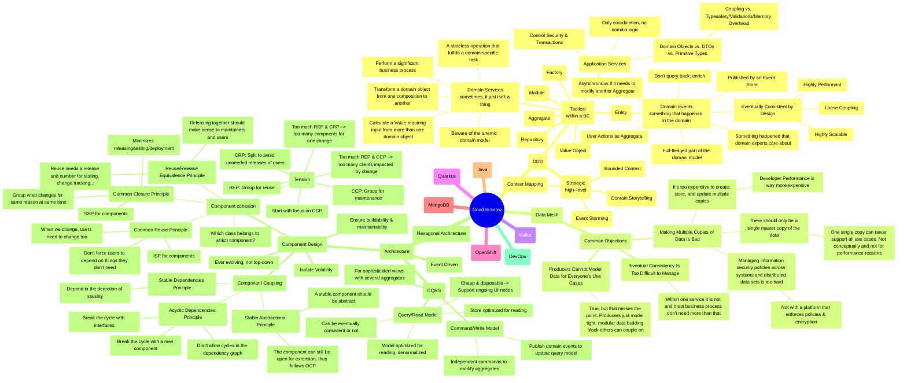

# Good to know

```mermaid
 mindmap
  root((Good to know))
   (DDD)
    (Strategic<br>high–level)
     (Domain Storytelling)
     (Event Storming)
     (Context Mapping)
     (Bounded Context)
    (Tactical<br>within a BC)
     (Value Object)
     (Entity)
     (Aggregate)
     (Domain Services<br>sometimes, it just isn't a thing)
      [A stateless operation that fulfills a domain-specific task]
      [Perform a significant business process]
      [Transform a domain object from one composition to another]
      [Calculate a Value requiring input from more than one domain object]
      [Beware of the anemic domain model]
     (Domain Events<br>something that happened in the domain)
      [Something happened that domain experts care about]
      [Full-fledged part of the domain model]
      (Eventually Consistent by Design)
       [Loose Coupling]
       [Highly Scalable]
       [Highly Performant]
      [Don't query back, enrich]
      [User Actions as Aggregate]
      [Asynchronous if it needs to modify another Aggregate]
      [Published by an Event Store]
     (Factory)
     (Repository)
     (Module)
     (Application Services)
      [Only coordination, no domain logic]
      [Control Security & Transactions]
      (Domain Objects vs. DTOs vs. Primitive Types)
       [Coupling vs. Typesafety/Validations/Memory Overhead]
   (Data Mesh)
    (Common Objections)
     (Producers Cannot Model Data for Everyone’s Use Cases)
      [True, but that misses the point. Producers just model tight, modular data building block others can couple on]
     (Making Multiple Copies of Data Is Bad)
      (There should only be a single master copy of the data)
       [One single copy can never support all use cases. Not conceptually and not for performance reasons]
      (It’s too expensive to create, store, and update multiple copies)
       [Developer Performance is way more expensive)
      (Managing information security policies across systems and distributed data sets is too hard)
       [Not with a platform that enforces policies & encryption]
     (Eventual Consistency Is Too Difficult to Manage)
      [Within one service it is not and most business process don't need more than that)
   (Kafka)
   (Quarkus)
   (OpenShift)
   (MongoDB)
   (Java)
   (Architecture)
    (Hexagonal Architecture)
    (CQRS)
     [For sophisticated views with several aggregates]
     (Command/Write Model)
      [Independent commands to modify aggregates]
      [Publish domain events to update query model]
     (Query/Read Model)
      [Store optimized for reading]
      [Model optimized for reading, denormalized]
      [Cheap & disposable -> Support ongoing UI needs]
      [Can be eventually consistent or not]
    (Event Driven)
    (Component Design)
     [Ever evolving, not top-down]
     [Isolate Volatility]
     [Ensure buildability & maintainability]
     (Component cohesion)
      [Which class belongs to which component?]
      (Reuse/Release Equivalence Principle)
       [Reuse needs a release and number for testing, change tracking...]
       [Releasing together should make sense to maintainers and users]
      (Common Closure Principle)
       [Group what changes for same reason at same time]
       [SRP for components]
       [Minimizes releasing/testing/deployment]
      (Common Reuse Principle)
       [Don't force users to depend on things they don't need]
       [When we change, users need to change too]
       [ISP for components]
      (Tension)
       [REP: Group for reuse]
       [CCP: Group for maintenance]
       [CRP: Split to avoid unneeded releases of users]
       [Too much REP & CCP –> too many clients impacted by change]
       [Too much REP & CRP –> too many compnents for one change]
       [Start with focus on CCP]
     (Component Coupling)
      (Acyclic Dependencies Principle)
       [Don't allow cycles in the dependency graph]
       [Break the cycle with interfaces]
       [Break the cycle with a new component]
      (Stable Dependencies Principle)
       [Depend in the derection of stability]
      (Stable Abstractions Principle)
       [A stable component should be abstract]
       [The component can still be open for extension, thus follows OCP]
   (DevOps)
```
