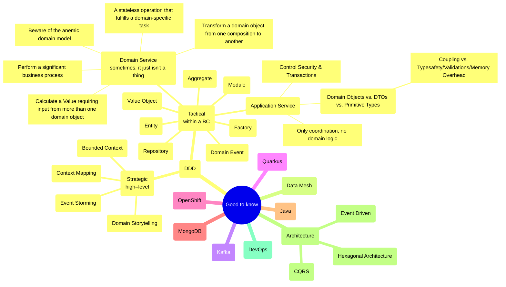

# Good to know

```mermaid
 mindmap
  root((Good to know))
   (DDD)
    (Strategic<br>high–level)
     (Domain Storytelling)
     (Event Storming)
     (Context Mapping)
     (Bounded Context)
    (Tactical<br>within a BC)
     (Value Object)
     (Entity)
     (Aggregate)
     (Domain Service<br>sometimes, it just isn't a thing)
      [A stateless operation that fulfills a domain-specific task]
      [Perform a significant business process]
      [Transform a domain object from one composition to another]
      [Calculate a Value requiring input from more than one domain object]
      [Beware of the anemic domain model]
     (Domain Event)
     (Factory)
     (Repository)
     (Module)
     (Application Service)
      [Only coordination, no domain logic]
      [Control Security & Transactions]
      (Domain Objects vs. DTOs vs. Primitive Types)
       [Coupling vs. Typesafety/Validations/Memory Overhead]
   (Data Mesh)
   (Kafka)
   (Quarkus)
   (OpenShift)
   (MongoDB)
   (Java)
   (Architecture)
    (Hexagonal Architecture)
    (CQRS)
    (Event Driven)
   (DevOps)
```
