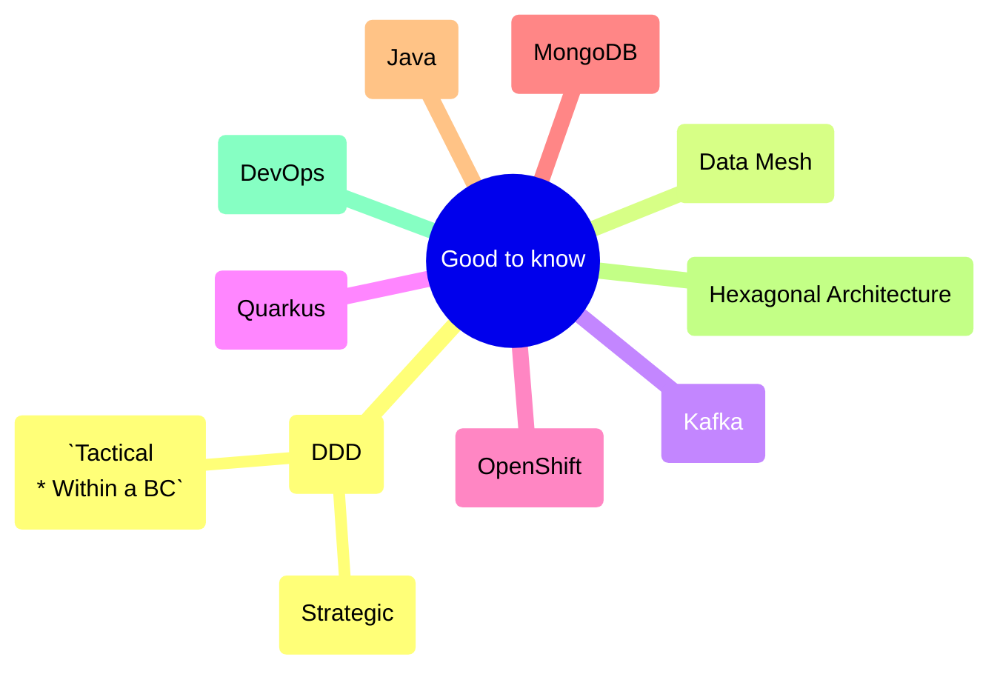

# Good to know

```mermaid
 mindmap
  root((Good to know))
   (DDD)
    (Strategic)
    ("ˋTactical
* Within a BCˋ")
   (Data Mesh)
   (Kafka)
   (Quarkus)
   (OpenShift)
   (MongoDB)
   (Java)
   (Hexagonal Architecture)
   (DevOps)
```
